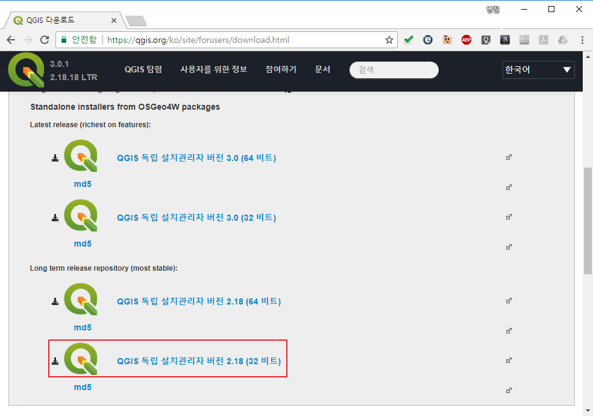
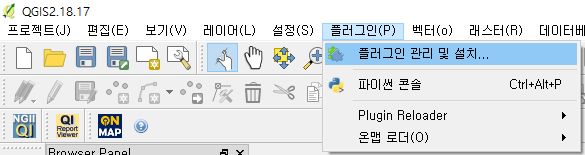
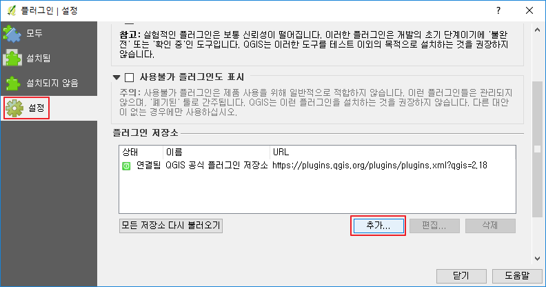
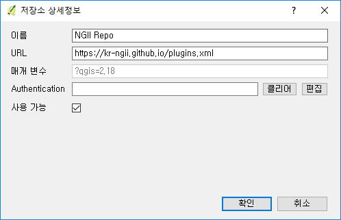
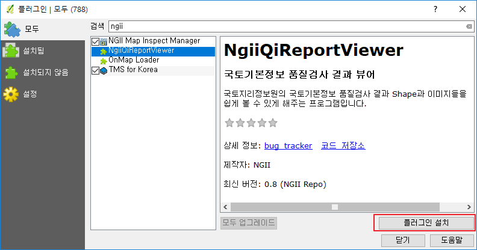

# 국토지리정보원 QGIS 플러그인 저장소
이 사이트는 국토지리정보원의 공간자료를 쉽게 사용할 수 있게 도와주는 플러그인과 품질검사 관련 플러그인 등의 유용한 QGIS 플러그인을 배포하는 저장소입니다.

## 사용방법
1. QGIS 설치
   - 이미 QGIS 2.14, 혹은 2.18 버전이 설치된 분은 이 단계를 무시하고 다음 단계로 넘어가시면 됩니다.
   - 아쉽게도 QGIS 3.0은 아직 지원되지 않습니다. 가능하시면 QGIS 2.18 버전을 사용해 주세요.
   - QGIS는 무료 오픈소스 GIS 프로그램으로 기업과 개인 누구나 자유롭게 사용 가능합니다.
   - QGIS 설치 프로그램 다운로드를 위해 다음 경로로 이동합니다. <https://qgis.org/ko/site/forusers/download.html>
   - 이 중'QGIS 독립 설치관리자 버전 2.18 버전'중 자신의 OS에 맞는 버전을 받으시면 됩니다.
   - 혹시 자신의 OS에 맞는 버전을 모르면 'QGIS 독립 설치관리자 버전 2.18 버전(32 비트)'를 받으시면 됩니다.
   
   - 다운로드 받은 설치관리자 프로그램은 실행하시고 다음, 다음만 하면 쉽게 설치됩니다.

2. 플러그인 관리자에 플러그인 저장소 경로 추가
   - QGIS가 설치되면 실행해 주십시오.
   - QGIS의 메뉴 중 [플러그인-플러그인 관리 및 설치...] 메뉴를 선택해 주십시오.
   
   - '플러그인 관리자' 창이 뜨면 [설정] 탭을 선택하고, [추가] 버튼을 눌러주십시오.
   
   - '저장소 상세정보' 창의 '이름'에 'NGII Repo', 'URL'에 'https://kr-ngii.github.io/plugins.xml'을 입력하시고 [확인] 버튼을 누러주세요.
   
   - NGII 저장소가 추가되며 저장소에서 정보를 다시 불러옵니다.
   - 혹시 저장소 정보를 불러오는 중 오류가 발생하면 [모든 저장소 다시 불러오기] 버튼을 누르면 대부분 해결 됩니다.

3. 원하는 플러그인 찾기와 설치
   - 이제 '플러그인 관리자'에서 [모두] 탭을 선택하고, '검색' 항목에 'ngii'를 입력합니다.
   - 그럼 국토지리정보원과 관련된 플러그인이 검색됩니다.
   - 설치를 원하는 플러그인을 선택하시고 [플러그인 설치] 버튼을 누르시면 쉽게 설치 됩니다.
   - 이 설명에서는 품질검사 결과 뷰어인 NgiiQiReportView를 예로 들겠습니다.
   

