# 국토지리정보원 QGIS 플러그인 저장소
이 사이트는 국토지리정보원의 공간자료를 쉽게 사용할 수 있게 도와주는 플러그인과 품질검사 관련 플러그인 등의 유용한 QGIS 플러그인을 배포하는 저장소입니다.

## 플러그인 저장소 이용 방법
1. QGIS 설치
   - 이미 QGIS 2.14, 혹은 2.18 버전이 설치된 분은 이 단계를 무시하고 다음 단계로 넘어가시면 됩니다.
   - [주의] 만약 윈도우의 사용자 이름이 '한글'이라면 QGIS가 실행은 되지만 정상적으로 안되는 기능이 많을 수 있고, 국토기본정보를 위한 대부분의 플러그인도 정상 동작하지 않습니다.
      
   - 확인 하는 방법은 키보드의 [윈도우키-R]을 을 누르면 나오는 '실행' 창에서 cmd 라 입력후 [확인] 해서 나오는 까만 도스장의 C:\Users 로 시작하는 부분에 한글나 빈칸이 있는지 보면 됩니다.
      
   - 혹시 여기에 한글이나 빈칸이 있다면 QGIS가 정상동작 안 할 것입니다.
      
   - 이 경우 영문명으로 윈도우 사용자를 새로 만드신 후 QGIS를 설치해 주세요.
      
   - 아쉽게도 QGIS 3.0은 아직 지원되지 않습니다. 가능하시면 QGIS 2.18 버전을 사용해 주세요.
   - QGIS는 무료 오픈소스 GIS 프로그램으로 기업과 개인 누구나 자유롭게 사용 가능합니다.
   - QGIS 설치 프로그램 다운로드를 위해 다음 경로로 이동합니다. <https://qgis.org/ko/site/forusers/download.html>
   - 이 중'QGIS 독립 설치관리자 버전 2.18 버전'중 자신의 OS에 맞는 버전을 받으시면 됩니다.
   - 혹시 자신의 OS에 맞는 버전을 모르면 'QGIS 독립 설치관리자 버전 2.18 버전(32 비트)'를 받으시면 됩니다.
   
   - 다운로드 받은 설치관리자 프로그램은 실행하시고 다음, 다음만 하면 쉽게 설치됩니다.

2. 플러그인 관리자에 플러그인 저장소 경로 추가
   - QGIS가 설치되면 실행해 주십시오.
   - QGIS의 메뉴 중 [플러그인-플러그인 관리 및 설치...] 메뉴를 선택해 주십시오.

   
   - '플러그인 관리자' 창이 뜨면 [설정] 탭을 선택하고, [추가] 버튼을 눌러주십시오.

   
   - '저장소 상세정보' 창의 '이름'에 'NGII Repo', 'URL'에 'https://kr-ngii.github.io/plugins.xml'을 입력하시고 [확인] 버튼을 누러주세요.

   
   - NGII 저장소가 추가되며 저장소에서 정보를 다시 불러옵니다.
   - 혹시 저장소 정보를 불러오는 중 오류가 발생하면 [모든 저장소 다시 불러오기] 버튼을 누르면 대부분 해결 됩니다.

3. 원하는 플러그인 찾기와 설치
   - 이제 '플러그인 관리자'에서 [모두] 탭을 선택하고, '검색' 항목에 'ngii'를 입력합니다.
   - 그럼 국토지리정보원과 관련된 플러그인이 검색됩니다.
   - 설치를 원하는 플러그인을 선택하시고 [플러그인 설치] 버튼을 누르시면 쉽게 설치 됩니다.
   - 이 설명에서는 품질검사 결과 뷰어인 NgiiQiReportView를 예로 들겠습니다.

   
   - ngii 라는 검색어로 검색된 플러그인 중 NgiiQiReportViewer를 선택하고
   - [플러그인 설치] 버튼을 누르면 플러그인이 자동으로 설치됩니다.
   - 설치가 정상적으로 수행되면 QGIS 메뉴에 'NGII'라는 메뉴 아래에 '품질검사 결과 뷰어'메뉴가 생기고 툴바에도 QI Report Viewer라는 버튼이 생기게 됩니다.

4. 외부사업자 품질검사툴을 위한 PostgreSQL과 PostGIS 설치
   - 국토정보지리원에서는 국토기본정보를 작성 혹은 수정해 납품하는 외부사업자가 자체적으로 품질을 검사후 납품할 수 있도록 '국토기본정보 품질검사툴'을 무료 배포합니다.
   - 품질검사툴은 데이터베이스 연산을 기반으로 동작하기 때문에 PostgreSQL이라는 DB와 공간정보를 다룰 수 있게 하는 확장팩인 PostGIS를 추가적으로 설치해 주어야 이용 가능합니다.
   - PostgreSQL과 PostGIS은 누구나 무료로 사용할 수 있는 오픈소스 소프트웨어이며 인터넷에서 무료로 다운로드 받아 설치 가능합니다.
   - PostgreSQL은 다음 링크에서 9.6 버전을 다운로드 받으시면 됩니다.
   - https://www.enterprisedb.com/downloads/postgres-postgresql-downloads
   - 다운로드 사이트에서 아래 그림처럼 'PostgreSQL 9.6.x' 와 'Windows x86-32'를 선택하시고 [DOWNLOAD NOW] 버튼을 클릭하시면 됩니다.

   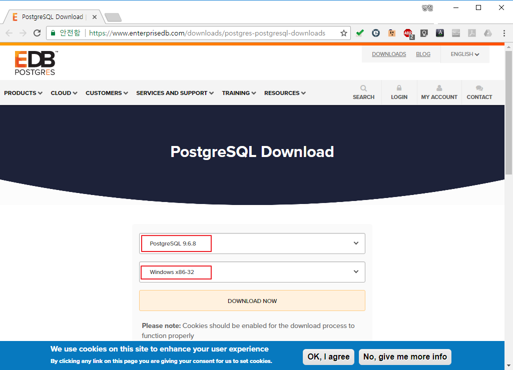
   - PostGIS는 다음 링크에서 2.4 버전을 다운로드 받으시면 됩니다.
   - http://download.osgeo.org/postgis/windows/pg96/
   - 이 페이지의 여러 파일 중 PostgreSQL과 버전이 맞는 것을 선택해야 하는데, 우리의 경우에는 postgis-bundle-pg96x32-setup-2.4.x.exe 와 유사한 이름을 가진 파일입니다.

   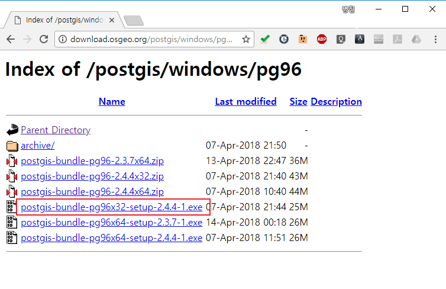
   - 두 프로그램 모두 설치 마법사이므로 설치는 쉽습니다.
   - PostgreSQL의 설치는 다운받은 'postgresql-9.6.x-windows' 파일을 실행하시고 [다음] 버튼만 누르면 거의 됩니다.
   - PostgreSQL에서는 관리자 계정인 postgres 계정의 아이디를 정하시고 기억해 주시는 것이 중요합니다. 보통 postgres 라는 계정과 동일한 암호를 사용합니다.
   - PostgreSQL 설치 마지막 단셰에 Stack Builder라는 확장툴을 설치할 수 있는 옵션이 실행되는데 이 단계는 추소하고 그냥 종료 하시면 됩니다.

   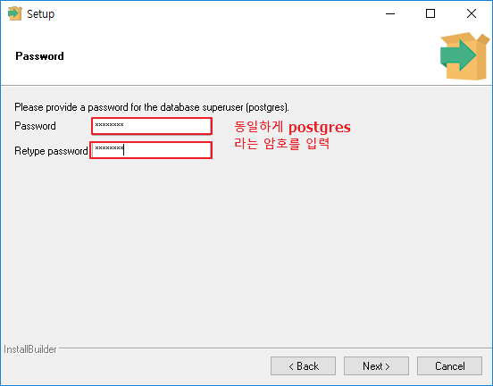
   - PostGIS의 설치도 다운로드 받은 'postgis-bundle-pg96x32-setup-2.4.4-1.exe' 파일을 실행하기만 하면 어렵지 않게 할 수 있습니다.
   - 계속 [다음] 만 누르면 거의 되는데, PostgreSQL 설치시 지정했던 postgres 계정의 암호를 입력하는 화면만 주의하시면 됩니다.

   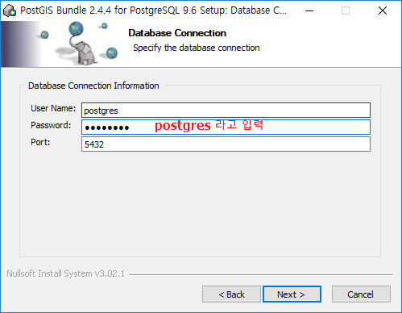

## 품질검사 프로그램 사용법
1. 시작하기
   - NGIIMapInspectManager 플러그인을 설치하면 QGIS 메뉴에 'NGII'라는 메뉴 아래에 '국토기본정보 품질검사' 메뉴가 생기고 툴바에도 NGII QI라는 메뉴가 생기게 됩니다.
   - 메뉴의 '국토기본정보 품질검사' 항목을 선택하거나 툴바의 NGII QI 라는 버튼을 선택하면 QGIS 화면 중앙에 검사 대상을 선택하는 화면이 나타납니다.
   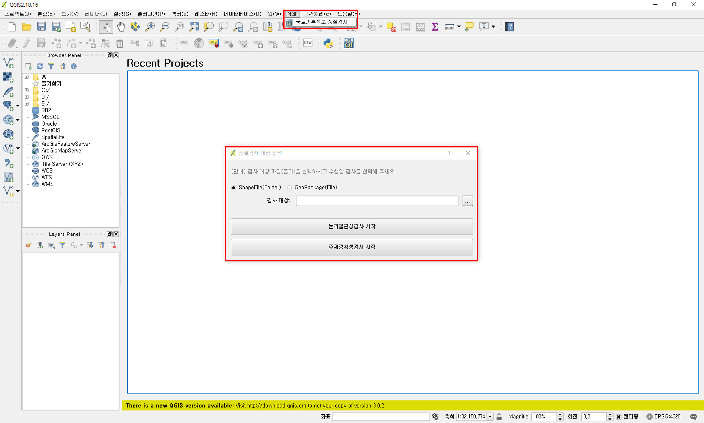

2. 검사 대상 선택하기
   - 품질검사 대상을 선택하는 과정입니다.
   - 품질검사 대상의 포맷은 ESRI Shapefile(.shp) 또는 GeoPackage(.gpkg)입니다. 검사 대상의 포맷은 옵션으로 설정할 수 있고, ESRI Shapefile은 파일이 있는 폴더를 선택하고 내부의 국토기본정보 표준에 맞는 파일을 검사합니다. GeoPackage는 단일 파일을 선택하여 검사합니다.
   - 검사 대상은 변동 구분에 따라서 추가(n), 삭제(r), 속성 수정(pe), 형상 수정(ge), 형상/속성 수정(pge)으로 구분하며, 파일을 분리하여 저장하여야 합니다. 이때 파일명은 "표준레이어명_변동구분"으로 저장합니다.
   - 예시) 건물의 추가 객체일 경우: **tn_buld_n**, 건물의 속성 수정 객체일 경우: **tn_buld_pe**
   - 변화하지 않은 주변 객체는 "표준레이어명"으로 저장하면 됩니다.
   - 예시) 변동되지 않은 기존 건물 객체: **tn_buld**
   - [주의] 검사 시 변동된 객체 뿐만 아니라 변동되지 않은 주변 객체와 국토지리정보원에서 제공되는 변동 레이어 이외의 표준 레이어들을 함께 검사해 정확한 검사 결과를 얻을 수 있습니다.
   - [주의] 별도의 변동타입을 구분하지 않고 검사 대상이 모두 표준레이어를 따를 경우, 모든 검사 대상을 새로 추가된 객체로 판단하여 전체 객체를 검사합니다.
   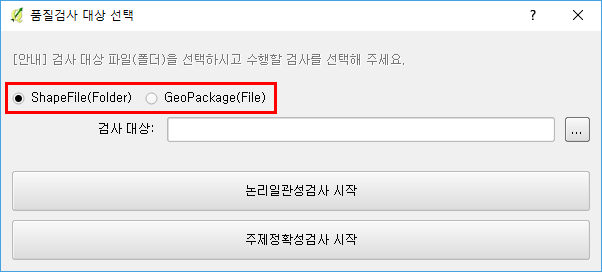

3. 논리일관성 검사하기
   - 검사 대상을 선택하면 하단의 "논리일관성 검사 시작" 버튼을 클릭합니다.
   - 논리일관성 검사는 자동 검사로 선택된 검사 대상을 불러와 품질기준에 따라 논리일관성 검사를 진행합니다.
   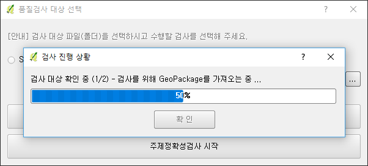

   - 논리일관성 검사가 시작되면 QGIS의 오른쪽에 '국토기본정보 검사' 창이 붙게 됩니다. 검사 진행 상황은 '국토기본정보 검사'의 최상단에 표시됩니다.
   - 검사를 진행하는 도중 오류가 발견되면 화면을 저장하고, '국토기본정보 검사' 창의 '오류 리스트'에 오류를 기록합니다.
   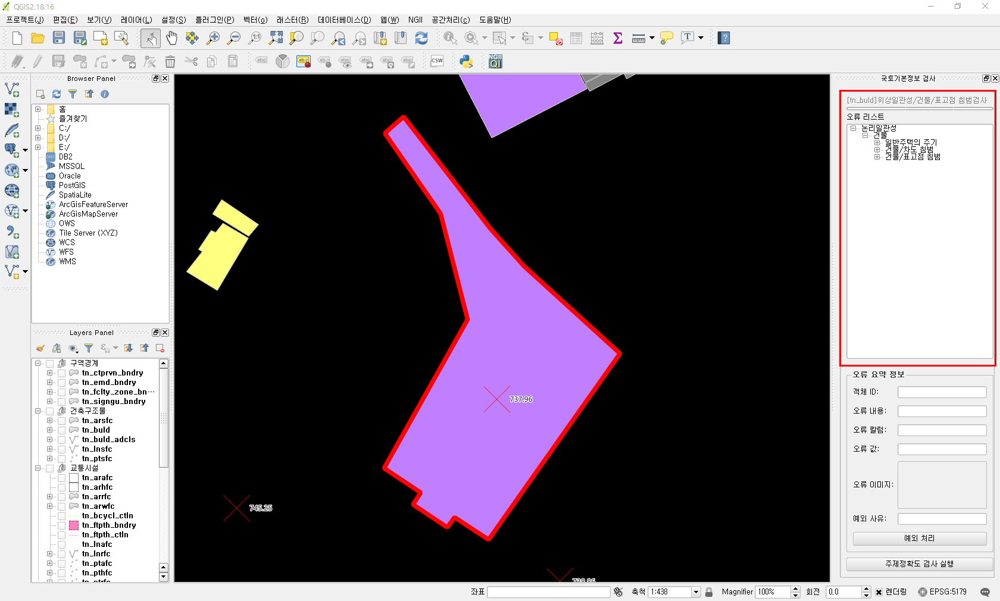

   - 검사가 완료되면 검사 완료 알림창이 나타납니다. 
   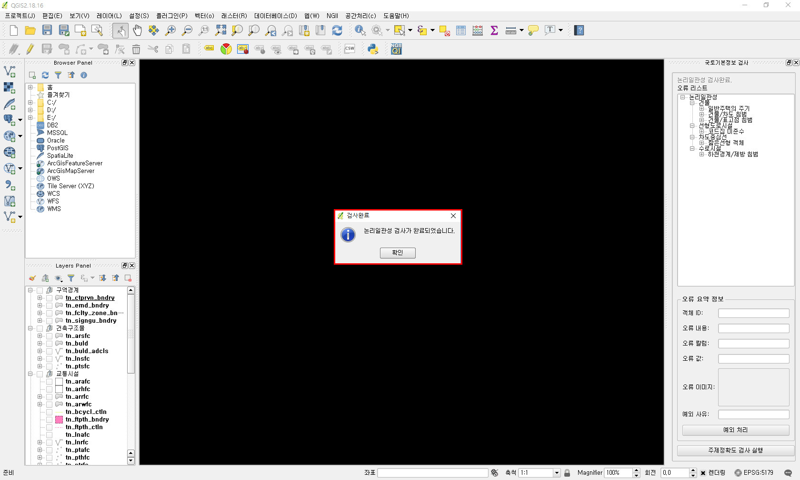

4. 검사 결과 확인하기
   - 논리일관성 검사가 완료되면 '국토기본정보 검사' 창의 '오류 리스트'에서 검사 결과를 확인할 수 있습니다.
   - '오류 리스트'는 트리 구조로 품질요소-레이어명-오류항목-객체ID 순으로 구성되어 있습니다. 오류항목을 열면 객체ID가 나타나고, 객체ID를 클릭하면 '오류 리스트' 하단의 '오류 요약 정보'에 정보가 나타납니다.
   - '오류 리스트'의 객체ID를 더블 클릭하면 오류의 위치로 이동하여, 해당 오류의 이미지를 QGIS에 불러옵니다.
   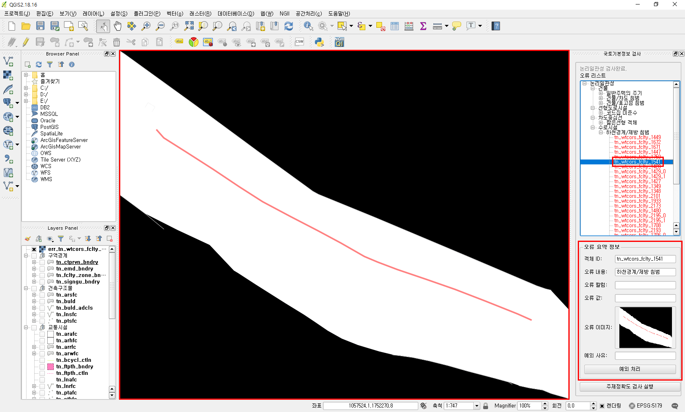

5. 예외 처리 하기
   - 검사 결과 중에서 실제로는 오류가 아닐 경우 예외로 처리할 수 있습니다.
   - 예시) 건물/차도경계면 침범 검사 중 실제로 검물이 차도 위에 있는 경우
   - 예외로 처리하고 싶은 오류가 있을 경우 '오류 리스트'의 해당 객체ID를 선택하고, '오류 요약 정보'의 '예외 처리'버튼을 클릭합니다.
   - 예외 사유 입력 창이 나타나면 예외 사유를 입력하고 '확인'버튼을 클릭합니다. 
   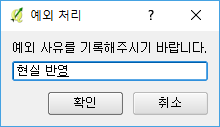
   - 예외로 처리된 객체는 '오류 리스트'에서 객체ID가 검은색으로 표기됩니다.
   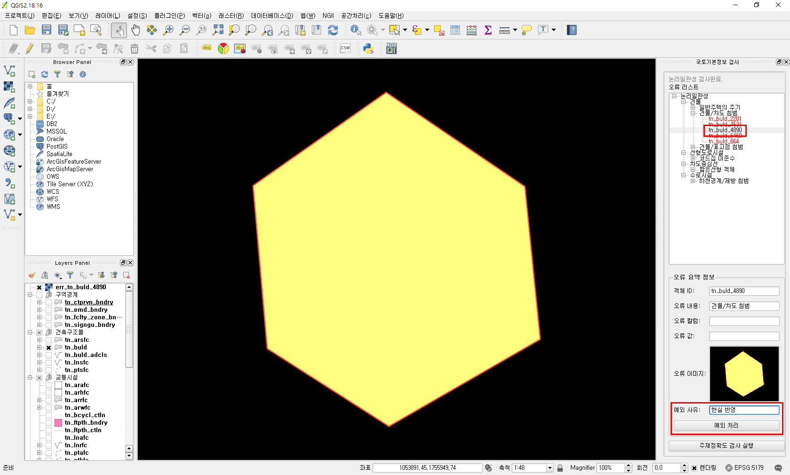

6. 검사 결과 파일 확인
   - 논리일관성 검사가 완료되면 사용자 폴더 아래의 .qgis2/qi_result 폴더에 오류 이미지들과 납품용 GeoPackage 파일이 생성되게 됩니다.
   - 이 폴더를 이용하여 "품질검사 결과 뷰어"에서 다시 검사 결과를 확인할 수 있습니다.
   - 납품용 GeoPackage 파일에는 오류 내역과 예외 사유가 기록되어 있으며, 이 정보는 국토지리정보원 내부 검사에서 유지되어 품질검사에 활용됩니다.
   - [주의] 오류 내역과 예외 사유가 있을 경우에는 다음 검사에서도 유지됩니다. 납품용 GeoPackage에는 오류 내역과 예외 사유가 기록되지만, 검사 대상 원본에는 기록되어 있지 않습니다.
   

7. 주제정확도 검사하기
   - 주제정확도 검사는 '감사 대상 선택' 창 또는 '국토기본정보 검사' 창에서 실행할 수 있습니다.
   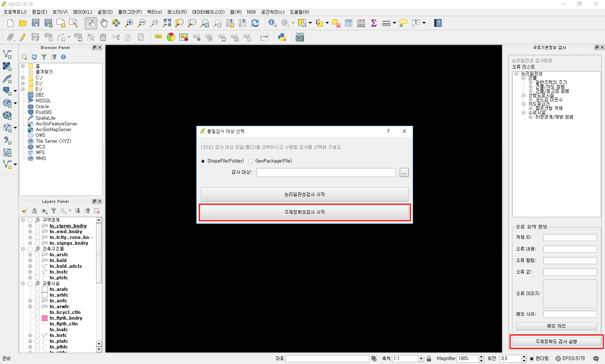

   - 주제정확도 검사에서는 실제 내부 검사에 사용되는 화면만 제공되고, 오류 기록 기능은 제공하지 않습니다. 
   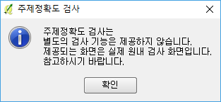
   
   - 실제 내부 검사에 사용될 스타일이 적용된 화면입니다.
   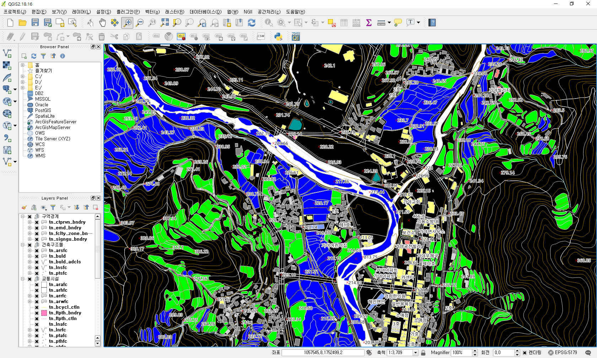

## 품질검사 결과 뷰어 사용법
1. 시작하기
   - NgiiQiReportView 플러그인을 설치하면 QGIS 메뉴에 'NGII'라는 메뉴 아래에 '품질검사 결과 뷰어'메뉴가 생기고 툴바에도 QI Report Viewer라는 버튼이 생기게 됩니다.
   - 메뉴의 '품질검사 결과 뷰어' 항목을 선택하거나 툴바의 QI Report Viewer라는 버튼을 선택하면 QGIS 화면 오른쪽에 '품질검사 결과 뷰어' 창이 붙게 됩니다.
   - 다시 한번 해당 메뉴나 툴바의 버튼을 클릭하면 사라지고, 만일 사라진 '품질검사 결과 뷰어' 창을 다시 생기게 하고 싶다면 다시 메뉴나 버튼을 선택하면 됩니다.
   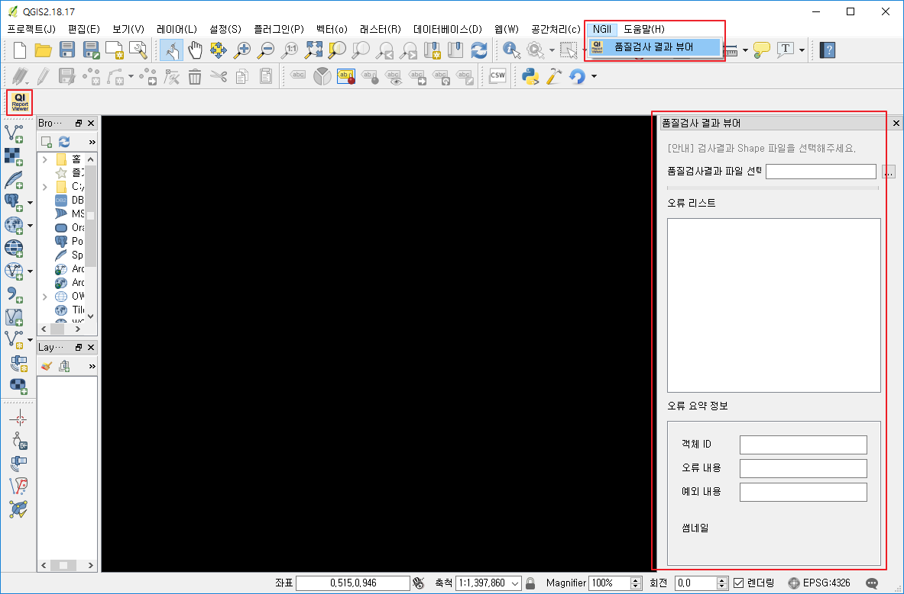

2. 검사결과 불러오기
   - 국토기본정보 품질검사 결과로 생긴 검사결과 Shape 파일을 공간정보로 보는 과정입니다.
   - 검사 결과는 국토기본정보 품질검사 프로그램으로 검사 후 사용자 폴더 아래의 .qgis2/qi_result 폴더에 생기게 됩니다.
   - '검사결과파일 선택' 부분의 [...] 버튼을 클릭하면 파일을 선택하는 창이 나옵니다.
   - 여기서 검사결과가 있는 폴더로 가서 err_index.shp, 혹은 err_idx.shp 파일을 선택해 주면 됩니다.
   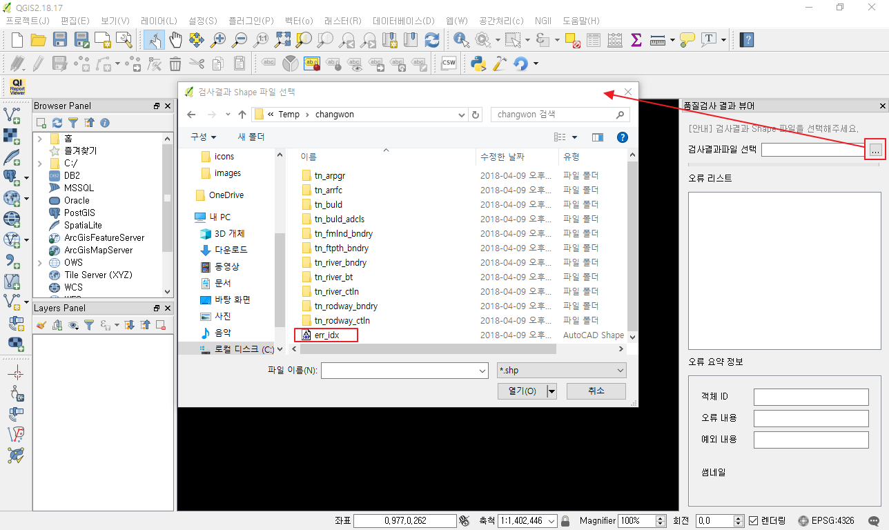

3. 개별 오류내용 보기
   - 검사결과 파일을 선택하시면, 해당 파일을 분석해서 오류리스트에 오류 내용이 계층구조로 나오게 됩니다.
   - 초기에 오류내용은 오류 종류별 항목까지만 펼쳐저 있습니다. 이 항목을 펼치면 세부 오류 항목이 나옵니다.
   - 예를 들어 논리일관성 - 건물 - 건물/차도 침범 항목을 펼치면 오류 항목들이 나오고, 각 항목을 더블클릭 하면,
   - 오류가 발생한 위치로 화면이 이동하고, 오류 상황의 캡처 화면이 보이게 됩니다.
   - 오류 요약 정보 부분에는 객체ID(지지변 등록ID), 오류내용, 예외 내용(입력된 경우만), 썸네일(오류 캡처)이 보이게 됩니다.
   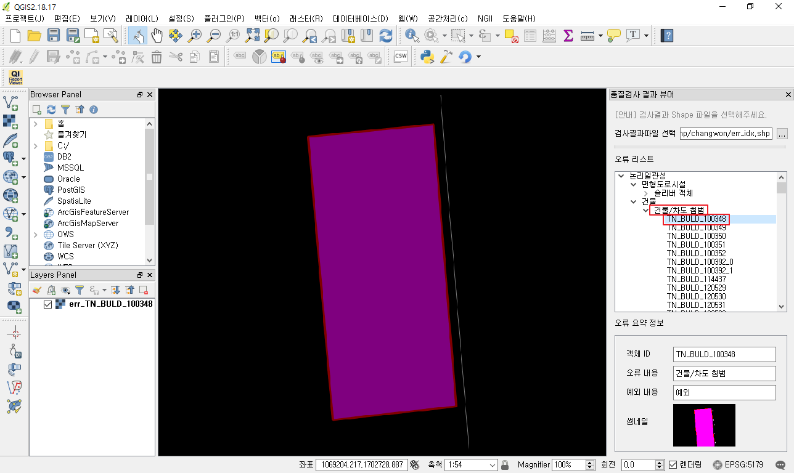

4. 납품 국토기본정보 데이터 불러오기
   - 오류 화면만 봐서는 오류의 상황이 명확하지 않은 경우가 많습니다.
   - 이 때 판단을 위해서는 납품된 국토기본정보 자료를 불러오셔야 합니다.
   - 국토기본정보 파일 중 TN_BULD 파일이 건물이며, TN_RLROAD_BNDRY 파일이 차도경계면입니다.
   - 기타 국토기본정보 레이어 명은 표준문서를 참고하시면 아실 수 있습니다.
   - 예를 들어 QGIS 화면의 왼쪽에 있는 Browser Panel에서 건물 데이터인 TN_BULD 파일을 더블클릭 하면 해당 파일이 Layers Panel로 들어오게 됩니다.
   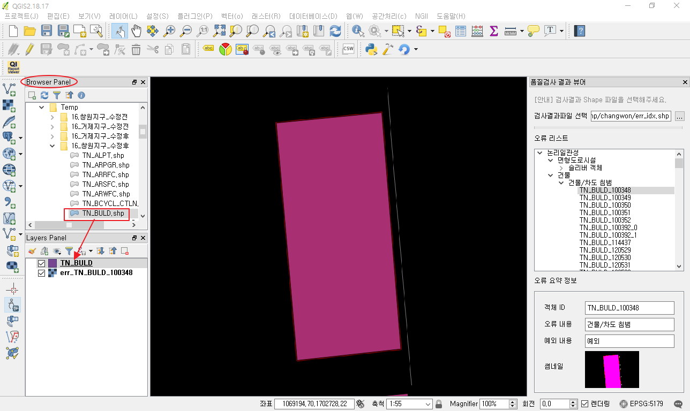

5. 객체 속성을 시각화하기
   - 대부분 건물이 도로경계면을 침범하면 오류입니다.
   - 하지만, 건물 중 무백건물은 도로위에 올라올 수 있기에 건물을 종류별로 시각화 할 필요가 있습니다.
   - Browser Panel의 TN_BULD 파일을 오른쪽 마우스로 클릭하고 [속성] 메뉴를 선택하면 레이어 속성 창이 뜹니다.
   - 레이어 속성 창의 오른쪽에 있는 [스타일] 탭을 선택합니다.
   - 상단에 'Single symbol'(혹은 '단순 심벌') 부분을 선택하면 여러가지 표현방법이 나옵니다.
   - 이 중 '분류값 사용'을 선택합니다.
   - '컬럼' 항목에서 'BULD_SE' 컬럼을 선택합니다.
   - 중간 부분의 [분류] 버튼을 클릭합니다.
   - 하단의 [확인] 버튼을 클릭해 창을 닫으면 건물 종류에 따라 색이 달라진 것을 확인할 수 있습니다.
   - 도로경계면도 유사한 과정을 거쳐 속성별로 시각화 할 수 있습니다.
   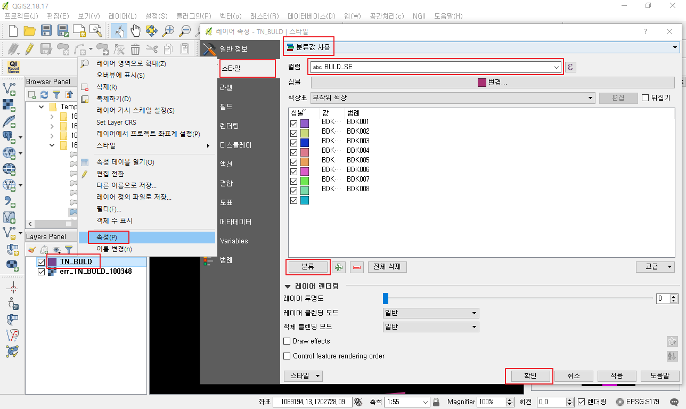

6. 인터넷 지도 플러그(TMS for Korea)인 설치
   - 일반 인터넷 지도도 참고자료로 유용한 경우가 많습니다. 이를 불러와 보겠습니다.
   - 인터넷 지도를 불러오기 위해서는 TMS for Korea 플러그인이 가장 많이 사용됩니다.
   - QGIS의 플러그인-플러그인관리 및 설치 메뉴를 선택해 플러그인 관리자를 띄웁니다.
   - 검색에 korea를 입력하면 'TMS for Korea' 플러그인이 검색됩니다.
   - [플러그인 설치] 버튼을 누르면 자동으로 설치됩니다.
   - [닫기] 버튼을 눌러 플러그인 관리자를 닫습니다.
   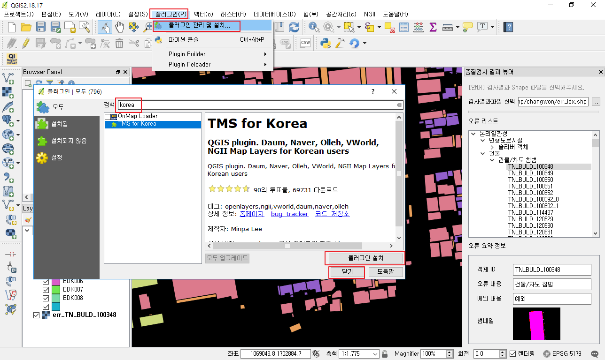

7. 네이버 지도 불러오기
   - QGIS 메뉴 중 웹-Naver Map-Naver Satellite 메뉴를 선택하면 지리원 정사영상과 동일한 항공영상을 불러올 수 있습니다.
   - 일반 인터넷 지도도 비슷한 방법으로 간단히 불러올 수 있습니다.
   - 한 가지 주의할 것이 QGIS에 여러 레이어를 불러올 수 있기에 레이어 순서가 중요한데, 간혹 Naver Satellite 등의 인터넷 지도가 다른 자료 위로 올라가 다른 자료가 안보이는 경우가 있습니다.
   - 이 경우 이 레이어를 Layer Panel에서 선택해 제일 아래에 있도록 끌어 내려주면 간단히 문제가 해결됩니다.
   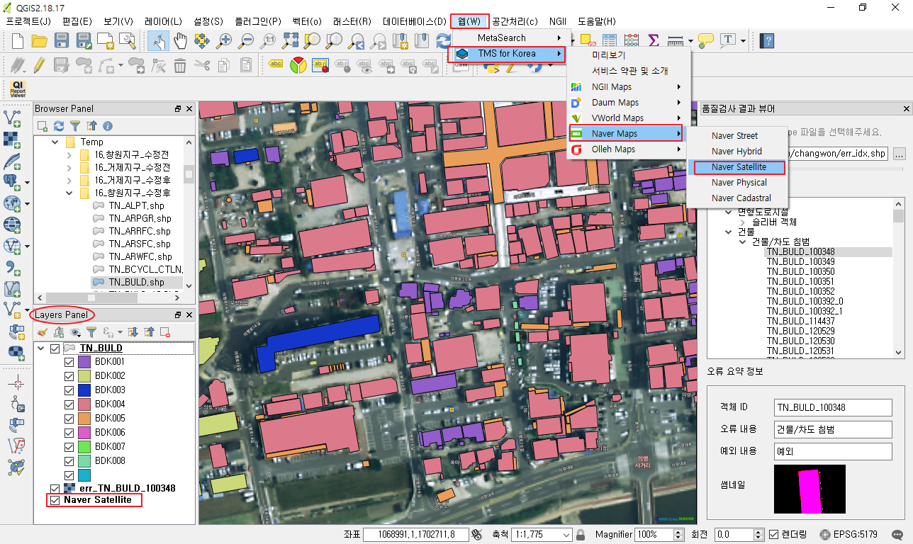

